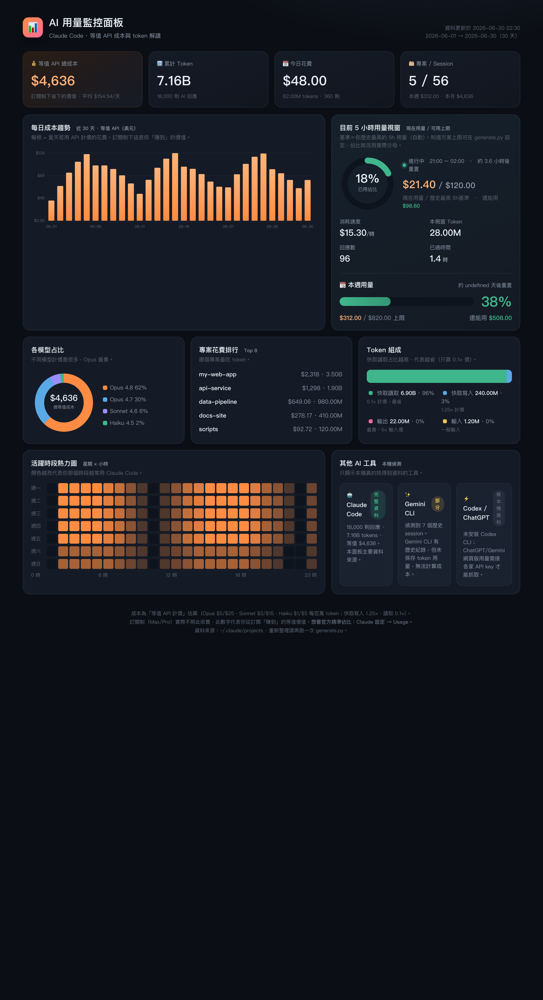

# Claude Code Usage Monitor

A beautiful, **zero-dependency** dashboard for your Claude Code usage. It reads the
local session logs under `~/.claude/projects`, computes token usage and the
**equivalent API cost**, and renders a polished, offline HTML dashboard.

> 繁體中文說明請見 [README.zh-TW.md](README.zh-TW.md)



**▶️ Live preview (synthetic data):** open [`docs/demo.html`](docs/demo.html) in your
browser — no setup, no personal data.

## Why

Claude Code's **Settings → Usage** shows your real plan limits (current session %,
weekly %). This tool is **complementary** — it shows what the official UI doesn't:

- 💰 **Equivalent API cost** — what your usage *would* cost at API prices (i.e. the value your subscription saves you)
- 📈 **Daily cost trend** (last 30 days)
- 🧩 **Per-model breakdown** (Opus / Sonnet / Haiku — they're priced very differently)
- 🗂️ **Per-project ranking** — which project burns the most tokens
- 🔬 **Token composition** — cache-read share (cache reads are billed at only 0.1×, so a high share means you're cheap to run)
- 🕒 **Activity heatmap** (weekday × hour)
- 🟢 **Current 5-hour window gauge** with a usage %

## Quick start

No install, no dependencies — just Python 3 (which ships with macOS).

```bash
git clone https://github.com/<you>/claude-code-usage-monitor.git
cd claude-code-usage-monitor
python3 generate.py            # parse usage + open the dashboard
# or
python3 generate.py --no-open  # just write index.html
```

Re-run `generate.py` any time to refresh `index.html` with your latest usage.

On macOS you can double-click **`更新並開啟.command`** (rename it if you like) to
refresh and open in one step.

## Commands

```bash
python3 generate.py             # build dashboard + open in browser
python3 generate.py --no-open   # build only
python3 generate.py --summary   # print a text summary in the terminal (no browser)
python3 generate.py --oneline   # one compact line — great for a status bar
python3 generate.py --notify 80 # desktop notification if 5h OR weekly usage ≥ 80%
python3 generate.py --calibrate # match the gauge to your official Settings → Usage %
python3 generate.py --demo      # render with synthetic data (for screenshots)
```

`--summary` looks like:

```
  📊 Claude Code 用量摘要（Max (5x)）   2026-06-30 22:49
  ──────────────────────────────────────────────
  5 小時視窗 :   19%   $30.73 / $160.14   約 4.2 小時後重置
  本週用量   :   12%   $129.77 / $1,083   約 5.0 天後重置
  今日花費   : $74.42   ·  累計等值 $5,339  ·  7.13B tokens
```

### Status bar integration (Claude Code)

`--oneline` prints `⛁ 5h 19% · 週 12% · 今日 $74.42`. Wire it into your Claude Code
[statusline](https://docs.claude.com/en/docs/claude-code/statusline) or a macOS menu-bar
tool (e.g. [xbar](https://xbarapp.com/)) to keep usage in view.

### Desktop alerts (cron)

```bash
# notify when usage crosses 80%, checked every 15 min
*/15 * * * * /usr/bin/python3 ~/path/to/claude-usage-dashboard/generate.py --notify 80
```
macOS uses `osascript`, Linux uses `notify-send`.

### Calibrate the gauge to your real plan %

Anthropic doesn't expose your plan's token limit, but you can **anchor** the gauge to
the official numbers. Open Claude Code → **Settings → Usage**, then:

```bash
python3 generate.py --calibrate
# it asks: "official current session shows what %?"  → e.g. 15
#          "official weekly shows what %?"           → e.g. 38
```

It back-computes the equivalent-cost ceiling from your current usage and saves it to
`config.json` (gitignored). From then on the gauge tracks much closer to the official
page. Re-run occasionally if it drifts.

Non-interactive form (scriptable):

```bash
python3 generate.py --calibrate 5h=15 week=38 plan="Max (5x)"
```

> Tip: the **weekly** anchor is the most stable (it accumulates over the week). The
> **5h** anchor is rougher because that window resets every 5 hours — for best results
> read both numbers off Settings → Usage at the same moment you run `--calibrate`.

## The usage % gauge — read this

Anthropic does **not** write your plan's real token limit to disk, so this tool
**cannot** reproduce the exact percentages from Settings → Usage. Instead it
offers two honest options for the gauge's denominator:

1. **Auto (default)** — uses your own **historical peak** 5-hour / weekly usage as
   the baseline. Meaning: *"you're at X% of your personal record."* 100% from real data.
2. **Manual** — if you know your plan, set a fixed equivalent-cost ceiling in
   `generate.py`:
   ```python
   PLAN_5H_LIMIT_USD = None       # e.g. set a USD ceiling for one 5h window
   PLAN_WEEKLY_LIMIT_USD = None   # e.g. weekly ceiling
   ```

The gauge is computed from **equivalent cost**, not raw tokens — because cache
reads (often 90%+ of tokens) are nearly free, so a token-based denominator would
be badly skewed.

**For your true plan %, always trust Settings → Usage.** This dashboard is for the
analytics that page doesn't give you.

## Pricing table (USD per million tokens)

| Model | Input | Output | Cache write | Cache read |
|---|---|---|---|---|
| Opus | $5 | $25 | $6.25 | $0.50 |
| Sonnet | $3 | $15 | $3.75 | $0.30 |
| Haiku | $1 | $5 | $1.25 | $0.10 |

Edit the `PRICING` dict in `generate.py` if prices change.

## How it works

1. Globs `~/.claude/projects/**/*.jsonl`
2. For each assistant message with a `usage` block, dedupes by `message.id + requestId`
   (same approach as [ccusage](https://github.com/ryoppippi/ccusage))
3. Sums tokens, computes equivalent cost per model
4. Aggregates by day / model / project / 5h-window / week / hour-of-week
5. Writes a self-contained `index.html` (inline SVG charts, no CDN, works offline)

## Files

| File | Purpose |
|---|---|
| `generate.py` | Parse + price + render (the whole thing) |
| `index.html` | Generated dashboard (gitignored — contains your data) |
| `serve.py` | Tiny threaded static server for local preview (optional) |
| `更新並開啟.command` | macOS double-click to refresh |

## Auto-refresh daily (optional)

```bash
crontab -e
# refresh every morning at 9:
0 9 * * * /usr/bin/python3 ~/path/to/claude-code-usage-monitor/generate.py --no-open
```

## Privacy

Everything runs locally. Nothing is uploaded. The generated `index.html` embeds
your usage data, so it's **gitignored** by default — don't commit it.

## Credits

Inspired by the approach of
[ccusage](https://github.com/ryoppippi/ccusage),
[yanowo/usage-monitor](https://github.com/yanowo/usage-monitor),
[DeppWang/Claude-Code-Usage-Tracker](https://github.com/DeppWang/Claude-Code-Usage-Tracker),
and [khscience/claude-usage-widget](https://github.com/khscience/claude-usage-widget).
Presentation and code are an independent rewrite.

## License

[MIT](LICENSE)
